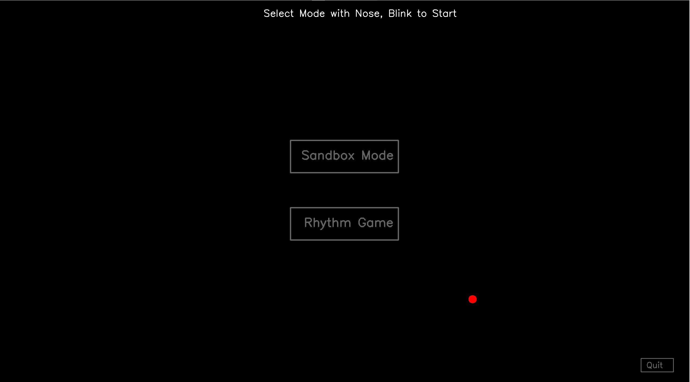
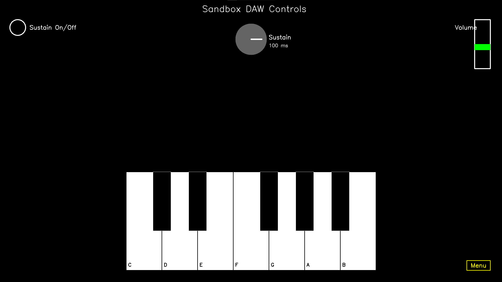
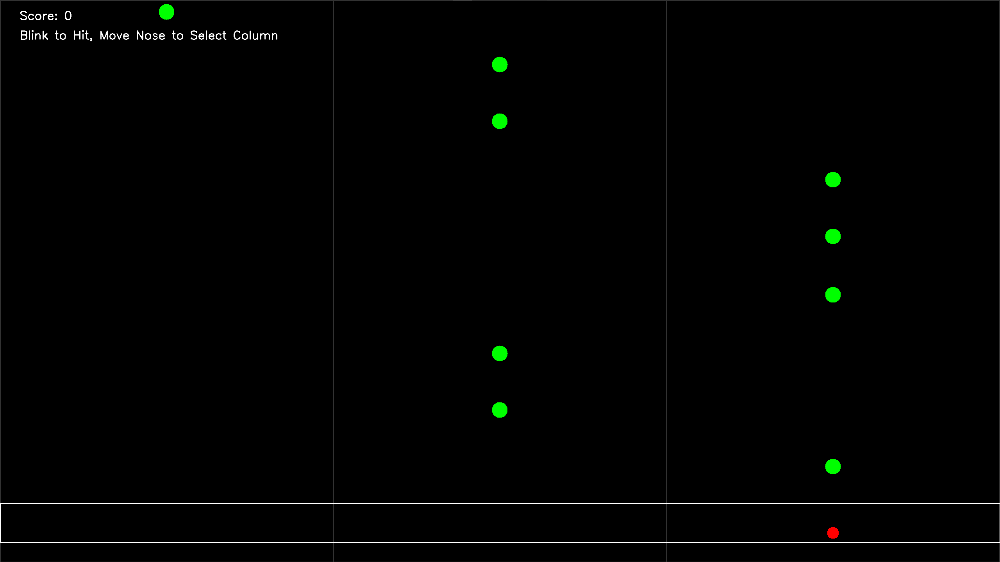

# NoseHero

**NoseHero** is a hands-free musical experience controlled entirely by your nose and eye blinks! Designed to explore accessible music interaction, NoseHero lets you play a piano sandbox or jam along in a rhythm game using just your face.

---

## Features

- **Nose-tracking cursor** (via webcam)
- **Eye-blink detection** to trigger actions
- **Sandbox Mode** with:
  - Virtual piano keys
  - Volume slider
  - Sustain knob
  - Sustain toggle switch
- **Rhythm Game**:
  - Hit notes in time with nose + blink
  - 3-column gameplay with scoring
  - End screen to retry or return to menu
- Calibration support for improved tracking accuracy
- Works full-screen with mouse hidden

---

## Installation

1. **Clone the repo**:
```bash
git clone https://github.com/robertom96/NoseHero.git
cd NoseHero
```

2. **Install dependencies**:
```bash
pip install -r requirements.txt
```

3. **Run the app**:
```bash
python main_menu.py
```

---

⚠️ Python Version Compatibility

Mediapipe has limited support for newer Python versions.
For best compatibility, use Python **3.11.x** when running NoseHero.

NoseHero was originally developed on Python 3.12 with a manually configured environment.
Some dependencies like `mediapipe` may require Python 3.11 or earlier for clean installs.

---

## Controls

### In All Modes
- **Move your nose** to move the cursor
- **Blink** to click
- **'q'** to quit anytime

### Sandbox Mode
- Blink on:
  - **Keys** to play notes
  - **Volume slider** to adjust volume
  - **Sustain knob** to change fade-out length
  - **Sustain toggle** to enable/disable effect
  - **Menu button** to return

### Rhythm Game
- Move your nose to the right column
- Blink to hit notes in the white bar
- At the end:
  - Blink left column = Retry
  - Blink right column = Menu

---

## Assets
- All piano sounds are loaded from `assets/piano/`
- Ensure your `calibration_settings.json` is present in the root folder

---

## Credits
Created by Robert McAlpine-myss for a Software Engineering (BEng) dissertation exploring accessible music technology.

Built using:
- [MediaPipe](https://github.com/google/mediapipe)
- [PyAutoGUI](https://github.com/asigart/pyautogui)
- [Pygame](https://www.pygame.org/)
- [OpenCV](https://opencv.org/)

---

## Dissertation Note
This project demonstrates an experimental DAW-like interface controlled by webcam-based gaze and blink tracking. It aims to inspire more accessible, gamified music interfaces for people with motor disabilities.

---

## Screenshots

### Main Menu


### Sandbox Mode


### Rhythm Game

---

## Contributions Welcome
Feel free to fork the project, submit issues, or contribute improvements!

---

## License
MIT License

---

